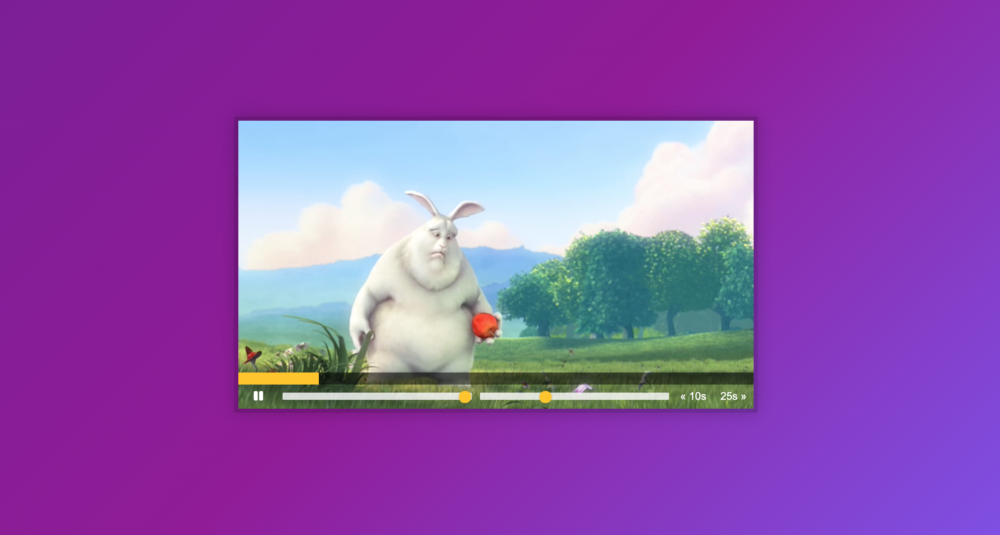

# HTML5 Video Player

Day 11 of Javascript30 by WesBos. Made a Video player where you can change the volume, the playback rate. You can skip 25s forward and 10s backward. You can change the time stamp by clicking on the yellow slide. You can start/pause by clicking on the video and on the play button

# Demo

# Technologies Used

HTML5, CSS, Vanilla JS

# Website

https://buigabor.github.io/HTML-video-player/
